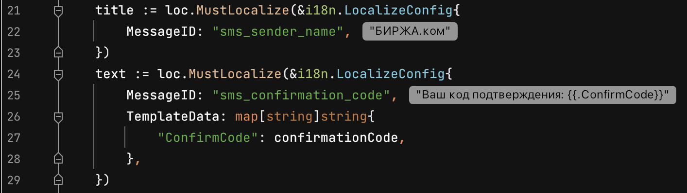

# golangconf-demo

Пример плагина для GoLand.

Как попробовать:
1. Открыть проект в IDEA Ultimate
2. В `MyHints.kt` в `getRuTranslation()` изменить путь к захардкоженному файлу из `goproject_example`
3. Нажать "Run plugin", как мы делали на демке
4. В запустившейся GoLand открыть папку `goproject_example`
5. Должны отображаться текстовые переводы рядом с i18n-ключами:

